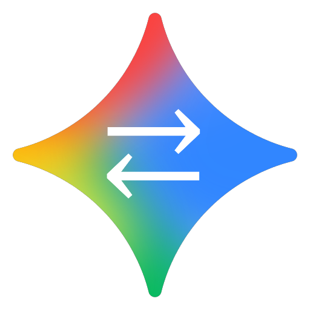

#  Gemini Code Assist RTL Support
### Adds Right-to-Left (`RTL`) text support for Hebrew, Arabic & Persian to `Gemini Code Assist` in VS Code, Cursor & Antigravity.

> If you find this extension useful, please rate it on the [VS Code Marketplace](https://marketplace.visualstudio.com/items?itemName=yechielby.gemini-code-assist-rtl&ssr=false#review-details) or [Open VSX](https://open-vsx.org/extension/yechielby/gemini-code-assist-rtl/reviews), and [give it a ⭐ on GitHub](https://github.com/YechielBy/gemini-code-assist-rtl-extension) — it helps others discover it!

---

## 🌐 Languages | שפות | اللغات | زبان‌ها

| | Language | | Quick Links |
|---|---|---|---|
| 🇺🇸 | English |  | [View Extension Explanation ↓](#english) |
| 🇮🇱 | עברית |  | [להסבר על התוסף בעברית ↓](#hebrew) |
| 🇸🇦 | عربية |  | [لشرح الملحق بالعربية ↓](#arabic) |
| 🇮🇷 | فارسی |  | [برای توضیح افزونه به فارسی ↓](#persian) |

---

### 🎬 Demo

    
🖼️ RTL <strong>⇄</strong> Button

    

    
🖼️ Status Bar

    

[🔝 Back to top](#gemini-code-assist-rtl-support)

## 🇺🇸 English

A VS Code extension that adds Right-to-Left (RTL) text direction support to the **Gemini Code Assist** chat interface in VS Code, Cursor, and Antigravity. Designed for Hebrew, Arabic, and Persian speakers who want natural text alignment when chatting with Gemini — without affecting code blocks or UI elements.

### 🤔 Why is this needed?

The original Gemini Code Assist extension lacks native RTL support. This often results in:

- ❌ Hebrew, Arabic, and Persian text appearing misaligned
- ❌ Difficulty reading mixed-language conversations (code + RTL text)
- ❌ Inconsistent UI behavior in the chat panel

**Gemini Code Assist RTL Support** fixes these issues by intelligently injecting CSS and JS into Gemini's webview to handle text direction — while strictly preserving LTR for code blocks, diffs, and terminal outputs.

### ✨ Features

| Feature | Description |
|---|---|
| ⇄ Toggle Button | A floating ⇄ button inside the Gemini chat to switch RTL on/off |
| 🔍 Smart Auto-Detection | Automatically detects Hebrew, Arabic, and Persian text per element using a MutationObserver |
| 💻 Code Block Preservation | Strictly enforces LTR direction for all code blocks, keeping your code intact |
| ⇄ Per-Code-Block Toggle | Individual ⇄ buttons on each code block to toggle RTL for specific blocks (e.g. code comments in Hebrew) |
| 📊 Status Bar | Shows current RTL state at a glance — click to toggle |
| 🔄 Auto-Reactivate | Automatically restores RTL after Gemini Code Assist updates |
| 🚀 Auto-Activate on Install | RTL activates automatically on first install |

---

### 📋 Requirements

- [**Gemini Code Assist**](https://marketplace.visualstudio.com/items?itemName=google.geminicodeassist) (`google.geminicodeassist`) — must be installed

---

### 💻 Supported Platforms

| 🛠️ IDEs |
|---|
| VS Code |
| Cursor |
| Antigravity |

---

### 🚀 How to Use

#### 📊 Option 1: Status Bar

After installation, a status bar item appears at the bottom of VS Code:

| Status | Meaning |
|---|---|
| `Gemini RTL: On` ✅ | RTL is injected and active |
| `Gemini RTL: Off` ⭕ | RTL is not active |
| `Gemini RTL: N/A` ❌ | Gemini Code Assist extension not found |

**Click the status bar item** to toggle RTL on or off.

#### 🎯 Option 2: Command Palette

Press `Ctrl+Shift+P` (or `Cmd+Shift+P` on macOS) and search for:

| Command | Action |
|---|---|
| `Gemini RTL: Activate RTL` | ▶️ Inject RTL CSS/JS into Gemini Code Assist |
| `Gemini RTL: Deactivate RTL` | ⏹️ Remove RTL and restore original files from backup |
| `Gemini RTL: Check Status` | 🔍 View installation status in the Output channel |

> 🔄 **The window reloads automatically** after Activate / Deactivate to apply changes.

#### 💬 Using RTL in Chat

After activating RTL and reloading:

1. Open the Gemini Code Assist chat panel
2. Click the **⇄** button (floating at the top-right corner of the chat)
3. Text containing Hebrew, Arabic, or Persian will automatically align to the right
4. Click again to return to LTR
5. Use per-code-block **⇄** buttons to toggle RTL for individual code blocks

> 💡 **Tip:** The toggle state is remembered via localStorage — it persists across sessions until you click the button again.

> 🔄 **Auto-reactivate:** If Gemini Code Assist updates and replaces its files, RTL is automatically restored on the next startup.

---

### ↔️ What Changes in RTL Mode?

| ✅ Becomes RTL | 🔒 Stays LTR |
|---|---|
| User messages | Code blocks |
| Gemini's text responses | Diff previews |
| Lists and paragraphs | Code block actions |
| Headings and blockquotes | UI buttons |
| Dialog text | |
| Thinking summaries | |
| Chat history headers | |

---

### 🔧 Troubleshooting

<strong>❓ Can't find the plugin in Cursor or Antigravity</strong>

- Search for the plugin by its ID: `gemini-code-assist-rtl`
- The display name "Gemini Code Assist RTL Support" may not appear in search results on all platforms
- Use the exact ID `gemini-code-assist-rtl` in the extensions search bar

<strong>❓ Extension doesn't find Gemini Code Assist</strong>

- Make sure the "Gemini Code Assist" extension (`google.geminicodeassist`) is installed
- Check status with the `Gemini RTL: Check Status` command

<strong>❓ Changes not visible after activating</strong>

- Reload the window: `Ctrl+Shift+P` → `Developer: Reload Window`
- Or close and reopen VS Code / Cursor completely

<strong>❓ RTL stopped working after a Gemini Code Assist update</strong>

- When Gemini Code Assist updates, it replaces its files and RTL support is removed
- RTL is **automatically restored** on the next startup
- If it doesn't restore automatically, run **Gemini RTL: Activate RTL** manually

<strong>❓ Permission Denied error</strong>

- **Windows:** Try running VS Code as Administrator
- **macOS / Linux:** Check file permissions on the extensions directory

---

### 🤝 Related RTL-for-AI Projects

A small community of independent developers maintains userland RTL fixes for the AI-tooling stack. The surfaces are largely disjoint — pick whichever matches where you're hitting the BiDi problem, and cross-install as needed:

- **[Claude Code RTL Support](https://github.com/yechielby/claude-code-rtl-extension)** by YechielBy — VS Code extension that adds RTL support to Claude Code for VS Code chat interface. Companion extension from the same author.
- **[Adaptive-RTL-Extension](https://github.com/Lidor-Mashiach/Adaptive-RTL-Extension)** by Lidor Mashiach — generic browser extension with click-to-select RTL for any web page, including LLM chat UIs (Claude.ai, ChatGPT, Gemini, etc.).
- **[rtl-for-vs-code-agents](https://github.com/GuyRonnen/rtl-for-vs-code-agents)** by Guy Ronnen — VS Code extension covering the broader agent webview layer: GitHub Copilot, Cursor, Antigravity, Gemini Code Assist. Complementary to this extension's Gemini-specific fix.

---

### ⭐ Like it? Star it!

If this extension helped you, please [give it a ⭐ on GitHub](https://github.com/YechielBy/gemini-code-assist-rtl-extension) — it helps others discover it!

---

### 📄 License

MIT — see [LICENSE](LICENSE) for details.

[🔝 Back to top](#gemini-code-assist-rtl-support)

---

[🔝 חזרה למעלה](#gemini-code-assist-rtl-support)

## 🇮🇱 עברית

תוסף ל-VS Code שמוסיף תמיכת כיווניות מימין לשמאל (RTL) לממשק הצ'אט של **Gemini Code Assist**. מיועד לדוברי עברית, ערבית ופרסית שרוצים יישור טקסט טבעי בשיחה עם Gemini — מבלי לפגוע בבלוקי קוד או ברכיבי הממשק.

### 🤔 למה זה נחוץ?

תוסף Gemini Code Assist המקורי חסר תמיכת RTL מובנית. הדבר גורם לעיתים קרובות ל:

- ❌ טקסט עברי, ערבי ופרסי שמוצג בצורה לא מיושרת
- ❌ קושי בקריאת שיחות בשפות מעורבות (קוד + טקסט RTL)
- ❌ התנהגות ממשק לא עקבית בפאנל הצ'אט

**Gemini Code Assist RTL Support** פותר בעיות אלה על ידי הזרקה חכמה של CSS ו-JS ל-webview של Gemini לטיפול בכיווניות הטקסט — תוך שמירה קפדנית על LTR עבור בלוקי קוד, דיפים ופלטי טרמינל.

### ✨ תכונות

| תכונה | תיאור |
|---|---|
| ⇄ כפתור מתג | כפתור ⇄ צף בתוך הצ'אט של Gemini להחלפה בין RTL ל-LTR |
| 🔍 זיהוי אוטומטי חכם | מזהה אוטומטית טקסט בעברית, ערבית ופרסית לכל רכיב באמצעות MutationObserver |
| 💻 שימור בלוקי קוד | שומר על כיווניות LTR לכל בלוקי הקוד ללא פגיעה |
| ⇄ מתג לכל בלוק קוד | כפתורי ⇄ פרטניים על כל בלוק קוד להפעלת RTL לבלוקים ספציפיים (למשל הערות קוד בעברית) |
| 📊 שורת מצב | מציג את המצב הנוכחי בתחתית המסך — לחיצה מחליפה מצב |
| 🔄 הפעלה מחדש אוטומטית | משחזר RTL אוטומטית לאחר עדכון Gemini Code Assist |
| 🚀 הפעלה אוטומטית בהתקנה | RTL מופעל אוטומטית בהתקנה ראשונה |

---

### 📋 דרישות

- **Gemini Code Assist** &rlm;(`google.geminicodeassist`) — חייב להיות מותקן

---

### 💻 פלטפורמות נתמכות

| 🛠️ סביבות פיתוח |
|---|
| VS Code |
| Cursor |
| Antigravity |

---

### 🚀 איך להשתמש

#### 📊 אפשרות 1: שורת המצב (Status Bar)

לאחר ההתקנה, מופיע פריט בשורת המצב בתחתית המסך:

| סטטוס | משמעות |
|---|---|
| `Gemini RTL: On` ✅ | RTL מוזרק ופעיל |
| `Gemini RTL: Off` ⭕ | RTL לא פעיל |
| `Gemini RTL: N/A` ❌ | תוסף Gemini Code Assist לא נמצא |

**לחיצה על פריט שורת המצב** מחליפה בין הפעלה לכיבוי.

#### 🎯 אפשרות 2: לוח הפקודות (Command Palette)

לחץ `Ctrl+Shift+P` (macOS: `Cmd+Shift+P`) וחפש:

| פקודה | פעולה |
|---|---|
| `Gemini RTL: Activate RTL` | ▶️ הזרקת CSS/JS של RTL ל-Gemini Code Assist |
| `Gemini RTL: Deactivate RTL` | ⏹️ הסרת RTL ושחזור קבצים מקוריים מגיבוי |
| `Gemini RTL: Check Status` | 🔍 הצגת מצב ההתקנה בערוץ הפלט |

> 🔄 **החלון נטען מחדש אוטומטית** לאחר הפעלה / כיבוי כדי להחיל שינויים.

#### 💬 שימוש ב-RTL בצ'אט

לאחר הפעלה וטעינה מחדש:

1. פתח את פאנל הצ'אט של Gemini Code Assist
2. לחץ על הכפתור **⇄** (צף בפינה הימנית העליונה של הצ'אט)
3. טקסט שמכיל עברית, ערבית או פרסית ייושר אוטומטית לימין
4. לחץ שוב כדי לחזור ל-LTR
5. השתמש בכפתורי **⇄** על בלוקי קוד פרטניים כדי להפעיל RTL לבלוקים ספציפיים

> 💡 **טיפ:** מצב המתג נשמר ב-localStorage — הוא נשאר בין הפעלות עד שלוחצים שוב על הכפתור.

> 🔄 **הפעלה מחדש אוטומטית:** אם Gemini Code Assist מתעדכן ומחליף את הקבצים, RTL משוחזר אוטומטית בהפעלה הבאה.

---

### ↔️ מה משתנה במצב RTL?

| ✅ הופך ל-RTL | 🔒 נשאר LTR |
|---|---|
| הודעות המשתמש | בלוקי קוד |
| תשובות טקסט של Gemini | תצוגות דיף |
| רשימות ופסקאות | כפתורי פעולה של בלוקי קוד |
| כותרות וציטוטים | כפתורי ממשק |
| טקסט בדיאלוגים | |
| סיכומי חשיבה | |
| כותרות היסטוריית הצ'אט | |

---

### 🔧 פתרון בעיות

<strong>❓ לא מוצאים את התוסף ב-Cursor או Antigravity</strong>

- חפשו את התוסף לפי המזהה שלו: `gemini-code-assist-rtl`
- השם המלא "Gemini Code Assist RTL Support" לא תמיד מופיע בתוצאות חיפוש בכל הפלטפורמות
- השתמשו במזהה המדויק `gemini-code-assist-rtl` בשורת החיפוש של התוספים

<strong>❓ התוסף לא מוצא את Gemini Code Assist</strong>

- וודא שהתוסף "Gemini Code Assist" &rlm;(`google.geminicodeassist`) מותקן
- בדוק סטטוס עם הפקודה `Gemini RTL: Check Status`

<strong>❓ השינויים לא נראים לאחר ההפעלה</strong>

- טען חלון מחדש: `Ctrl+Shift+P` ← `Developer: Reload Window`
- או סגור ופתח מחדש את VS Code / Cursor

<strong>❓ ה-RTL הפסיק לעבוד לאחר עדכון Gemini Code Assist</strong>

- כשהתוסף Gemini Code Assist מתעדכן, הוא מחליף את קבציו ותמיכת ה-RTL נמחקת
- RTL **משוחזר אוטומטית** בהפעלה הבאה
- אם זה לא משוחזר אוטומטית, הפעל ידנית את **Gemini RTL: Activate RTL**

<strong>❓ שגיאת הרשאות</strong>

- **Windows:** נסה להריץ את VS Code כמנהל מערכת
- **macOS / Linux:** בדוק הרשאות קבצים בתיקיית ההרחבות

---

### 🤝 פרויקטים קשורים (RTL לכלים מבוססי AI)

קהילה קטנה של מפתחים עצמאיים מתחזקת תיקוני RTL לכלים שונים בסביבת ה-AI. הפרויקטים לרוב משלימים זה את זה — בחרו את הפתרון שמתאים לבעיית הכיווניות שאתם חווים, והתקינו במקביל לפי הצורך:

- **[Claude Code RTL Support](https://github.com/yechielby/claude-code-rtl-extension)** &rlm;(מאת YechielBy) — תוסף VS Code שמוסיף תמיכת RTL לממשק הצ'אט של Claude Code for VS Code. תוסף אח מאותו מפתח.
- **[Adaptive-RTL-Extension](https://github.com/Lidor-Mashiach/Adaptive-RTL-Extension)** &rlm;(מאת Lidor Mashiach) — תוסף דפדפן כללי עם בחירת RTL בלחיצה לכל דף אינטרנט, כולל ממשקי צ'אט של LLM (כמו Claude.ai, ChatGPT, Gemini ועוד).
- **[rtl-for-vs-code-agents](https://github.com/GuyRonnen/rtl-for-vs-code-agents)** &rlm;(מאת Guy Ronnen) — תוסף ל-VS Code המכסה את שכבת ה-webview הרחבה יותר של סוכני AI: GitHub Copilot, Cursor, Antigravity, Gemini Code Assist. משלים את התיקון הספציפי של התוסף הזה.

---

### ⭐ אהבתם? תנו כוכב!

אם התוסף עזר לכם, [תנו לו ⭐ ב-GitHub](https://github.com/YechielBy/gemini-code-assist-rtl-extension) — זה עוזר לאחרים לגלות אותו!

---

### 📄 רישיון

MIT — ראה קובץ [LICENSE](LICENSE) לפרטים.

[🔝 חזרה למעלה](#gemini-code-assist-rtl-support)

---

[🔝 العودة إلى الأعلى](#gemini-code-assist-rtl-support)

## 🇸🇦 عربية

إضافة لـ VS Code تضيف دعم اتجاه النص من اليمين إلى اليسار (RTL) لواجهة المحادثة في **Gemini Code Assist**. مصممة لمتحدثي العربية والعبرية والفارسية الذين يريدون محاذاة طبيعية للنص عند التحدث مع Gemini — دون التأثير على كتل الكود أو عناصر الواجهة.

### 🤔 لماذا هذا مطلوب؟

إضافة Gemini Code Assist الأصلية تفتقر إلى دعم RTL المدمج. وهذا كثيرًا ما يؤدي إلى:

- ❌ ظهور النصوص العربية والعبرية والفارسية بمحاذاة غير صحيحة
- ❌ صعوبة قراءة المحادثات متعددة اللغات (كود + نص RTL)
- ❌ سلوك غير متسق لواجهة المستخدم في لوحة المحادثة

**Gemini Code Assist RTL Support** تحل هذه المشكلات عن طريق حقن CSS و JS بذكاء في webview الخاص بـ Gemini للتعامل مع اتجاه النص — مع الحفاظ الصارم على LTR لكتل الكود والفروقات ومخرجات الطرفية.

### ✨ الميزات

| الميزة | الوصف |
|---|---|
| ⇄ زر التبديل | زر ⇄ عائم داخل محادثة Gemini للتبديل بين RTL و LTR |
| 🔍 كشف تلقائي ذكي | يكتشف تلقائيًا النص العربي والعبري والفارسي لكل عنصر باستخدام MutationObserver |
| 💻 حفظ كتل الكود | يفرض بصرامة اتجاه LTR لجميع كتل الكود |
| ⇄ تبديل لكل كتلة كود | أزرار ⇄ فردية على كل كتلة كود لتبديل RTL لكتل محددة (مثل تعليقات الكود بالعربية) |
| 📊 شريط الحالة | يعرض الحالة الحالية — انقر للتبديل |
| 🔄 إعادة تفعيل تلقائية | تستعيد RTL تلقائيًا بعد تحديث Gemini Code Assist |
| 🚀 تفعيل تلقائي عند التثبيت | يتم تفعيل RTL تلقائيًا عند التثبيت لأول مرة |

---

### 📋 المتطلبات

- **Gemini Code Assist** &rlm;(`google.geminicodeassist`) — يجب أن يكون مثبتًا

---

### 💻 المنصات المدعومة

| 🛠️ بيئات التطوير |
|---|
| VS Code |
| Cursor |
| Antigravity |

---

### 🚀 طريقة الاستخدام

#### 📊 الخيار 1: شريط الحالة

بعد التثبيت، يظهر عنصر في شريط الحالة في أسفل المحرر:

| الحالة | المعنى |
|---|---|
| `Gemini RTL: On` ✅ | RTL محقون ونشط |
| `Gemini RTL: Off` ⭕ | RTL غير نشط |
| `Gemini RTL: N/A` ❌ | إضافة Gemini Code Assist غير موجودة |

**انقر على عنصر شريط الحالة** للتبديل بين التفعيل والإيقاف.

#### 🎯 الخيار 2: لوحة الأوامر

اضغط `Ctrl+Shift+P` (ماك: `Cmd+Shift+P`) وابحث عن:

| الأمر | الإجراء |
|---|---|
| `Gemini RTL: Activate RTL` | ▶️ حقن CSS/JS الخاص بـ RTL في Gemini Code Assist |
| `Gemini RTL: Deactivate RTL` | ⏹️ إزالة RTL واستعادة الملفات الأصلية من النسخ الاحتياطية |
| `Gemini RTL: Check Status` | 🔍 عرض حالة التثبيت في قناة الإخراج |

> 🔄 **يتم إعادة تحميل النافذة تلقائيًا** بعد التفعيل / الإيقاف لتطبيق التغييرات.

#### 💬 الاستخدام في المحادثة

بعد التفعيل وإعادة التحميل:

1. افتح لوحة محادثة Gemini Code Assist
2. اضغط على الزر **⇄** (عائم في الزاوية العلوية اليمنى من المحادثة)
3. النص الذي يحتوي على عربية أو عبرية أو فارسية سيتم محاذاته تلقائيًا إلى اليمين
4. اضغط مرة أخرى للعودة إلى LTR
5. استخدم أزرار **⇄** على كتل الكود الفردية لتبديل RTL لكتل محددة

> 💡 **نصيحة:** يتم حفظ حالة التبديل في localStorage — تبقى بين الجلسات حتى تضغط على الزر مرة أخرى.

> 🔄 **إعادة تفعيل تلقائية:** إذا تم تحديث Gemini Code Assist واستبدال ملفاته، يتم استعادة RTL تلقائيًا عند بدء التشغيل التالي.

---

### ↔️ ماذا يتغير في وضع RTL؟

| ✅ يتحول إلى RTL | 🔒 يبقى LTR |
|---|---|
| رسائل المستخدم | كتل الكود |
| ردود نص Gemini | معاينات الفروقات |
| القوائم والفقرات | أزرار إجراءات كتل الكود |
| العناوين والاقتباسات | أزرار الواجهة |
| نصوص الحوارات | |
| ملخصات التفكير | |
| عناوين سجل المحادثات | |

---

### 🔧 حل المشاكل

<strong>❓ لا يمكن العثور على الإضافة في Cursor أو Antigravity</strong>

- ابحث عن الإضافة باستخدام معرّفها: `gemini-code-assist-rtl`
- الاسم الكامل "Gemini Code Assist RTL Support" قد لا يظهر في نتائج البحث على جميع المنصات
- استخدم المعرّف الدقيق `gemini-code-assist-rtl` في شريط البحث عن الإضافات

<strong>❓ الإضافة لا تجد Gemini Code Assist</strong>

- تأكد من تثبيت إضافة "Gemini Code Assist" &rlm;(`google.geminicodeassist`)
- تحقق من الحالة باستخدام الأمر `Gemini RTL: Check Status`

<strong>❓ التغييرات لا تظهر بعد التفعيل</strong>

- أعد تحميل النافذة: `Ctrl+Shift+P` ← `Developer: Reload Window`
- أو أغلق VS Code / Cursor وأعد فتحه

<strong>❓ توقف RTL عن العمل بعد تحديث Gemini Code Assist</strong>

- عند تحديث إضافة Gemini Code Assist، يتم استبدال ملفاتها وتُحذف تهيئة RTL
- يتم **استعادة RTL تلقائيًا** عند بدء التشغيل التالي
- إذا لم تتم الاستعادة تلقائيًا، شغّل **Gemini RTL: Activate RTL** يدويًا

<strong>❓ خطأ في الصلاحيات</strong>

- **Windows:** جرّب تشغيل VS Code كمسؤول
- **macOS / Linux:** تحقق من صلاحيات الملفات في مجلد الإضافات

---

### 🤝 مشاريع RTL ذات صلة بأدوات الذكاء الاصطناعي

يحتفظ مجتمع صغير من المطورين المستقلين بإصلاحات RTL لمختلف أدوات الذكاء الاصطناعي. المشاريع غالبًا ما تكمل بعضها البعض — اختر الحل الذي يناسب مشكلة الاتجاه التي تواجهها، وقم بتثبيتها معًا حسب الحاجة:

- **[Claude Code RTL Support](https://github.com/yechielby/claude-code-rtl-extension)** &rlm;(بواسطة YechielBy) — إضافة VS Code تضيف دعم RTL لواجهة محادثة Claude Code for VS Code. إضافة شقيقة من نفس المطور.
- **[Adaptive-RTL-Extension](https://github.com/Lidor-Mashiach/Adaptive-RTL-Extension)** &rlm;(بواسطة Lidor Mashiach) — إضافة متصفح عامة مع إمكانية تحديد RTL بنقرة لأي صفحة ويب، بما في ذلك واجهات محادثة LLM (مثل Claude.ai و ChatGPT و Gemini وغيرها).
- **[rtl-for-vs-code-agents](https://github.com/GuyRonnen/rtl-for-vs-code-agents)** &rlm;(بواسطة Guy Ronnen) — إضافة VS Code تغطي طبقة الـ webview الأوسع لوكلاء الذكاء الاصطناعي: GitHub Copilot، Cursor، Antigravity، Gemini Code Assist. تكمل هذا الإصلاح المخصص.

---

### ⭐ أعجبتك؟ امنحها نجمة!

إذا أعجبتك هذه الإضافة، [امنحها ⭐ على GitHub](https://github.com/YechielBy/gemini-code-assist-rtl-extension) — هذا يساعد الآخرين في اكتشافها!

---

### 📄 الترخيص

MIT — انظر ملف [LICENSE](LICENSE) للتفاصيل.

[🔝 العودة إلى الأعلى](#gemini-code-assist-rtl-support)

---

[🔝 بازگشت به بالا](#gemini-code-assist-rtl-support)

## 🇮🇷 فارسی

یک افزونه VS Code که پشتیبانی از جهت متن راست به چپ (RTL) را به رابط چت **Gemini Code Assist** اضافه می‌کند. طراحی شده برای فارسی‌زبانان، عبری‌زبانان و عربی‌زبانانی که می‌خواهند تراز متن طبیعی هنگام چت با Gemini داشته باشند — بدون تأثیر بر بلوک‌های کد یا عناصر رابط کاربری.

### 🤔 چرا این مورد نیاز است؟

افزونه اصلی Gemini Code Assist فاقد پشتیبانی بومی RTL است. این اغلب منجر به موارد زیر می‌شود:

- ❌ نمایش نامرتب متن فارسی، عربی و عبری
- ❌ دشواری در خواندن مکالمات چندزبانه (کد + متن RTL)
- ❌ رفتار ناسازگار رابط کاربری در پنل چت

**Gemini Code Assist RTL Support** این مشکلات را با تزریق هوشمند CSS و JS در webview جمینای برای مدیریت جهت متن حل می‌کند — در حالی که LTR را برای بلوک‌های کد، تفاوت‌ها و خروجی‌های ترمینال کاملاً حفظ می‌کند.

### ✨ ویژگی‌ها

| ویژگی | توضیح |
|---|---|
| ⇄ دکمه تغییر | دکمه ⇄ شناور داخل چت Gemini برای تغییر بین RTL و LTR |
| 🔍 شناسایی خودکار هوشمند | به‌طور خودکار متن فارسی، عربی و عبری را برای هر عنصر با استفاده از MutationObserver شناسایی می‌کند |
| 💻 حفظ بلوک‌های کد | به‌طور سختگیرانه جهت LTR را برای تمام بلوک‌های کد حفظ می‌کند |
| ⇄ تغییر برای هر بلوک کد | دکمه‌های ⇄ جداگانه روی هر بلوک کد برای تغییر RTL بلوک‌های خاص (مثلاً نظرات کد به فارسی) |
| 📊 نوار وضعیت | وضعیت فعلی را نشان می‌دهد — برای تغییر کلیک کنید |
| 🔄 فعال‌سازی مجدد خودکار | RTL را به‌طور خودکار پس از به‌روزرسانی Gemini Code Assist بازیابی می‌کند |
| 🚀 فعال‌سازی خودکار هنگام نصب | RTL به‌طور خودکار هنگام نصب اولیه فعال می‌شود |

---

### 📋 نیازمندی‌ها

- **Gemini Code Assist** &rlm;(`google.geminicodeassist`) — باید نصب شده باشد

---

### 💻 پلتفرم‌های پشتیبانی‌شده

| 🛠️ محیط‌های توسعه |
|---|
| VS Code |
| Cursor |
| Antigravity |

---

### 🚀 نحوه استفاده

#### 📊 گزینه ۱: نوار وضعیت

پس از نصب، یک آیتم در نوار وضعیت پایین VS Code نمایش داده می‌شود:

| وضعیت | معنی |
|---|---|
| `Gemini RTL: On` ✅ | RTL تزریق شده و فعال است |
| `Gemini RTL: Off` ⭕ | RTL فعال نیست |
| `Gemini RTL: N/A` ❌ | افزونه Gemini Code Assist پیدا نشد |

**روی آیتم نوار وضعیت کلیک کنید** تا بین فعال و غیرفعال تغییر کند.

#### 🎯 گزینه ۲: پالت فرمان

`Ctrl+Shift+P` (مک: `Cmd+Shift+P`) را فشار دهید و جستجو کنید:

| فرمان | عملکرد |
|---|---|
| `Gemini RTL: Activate RTL` | ▶️ تزریق CSS/JS مربوط به RTL در Gemini Code Assist |
| `Gemini RTL: Deactivate RTL` | ⏹️ حذف RTL و بازیابی فایل‌های اصلی از نسخه پشتیبان |
| `Gemini RTL: Check Status` | 🔍 نمایش وضعیت نصب در کانال خروجی |

> 🔄 **پنجره به‌طور خودکار مجدداً بارگذاری می‌شود** پس از فعال‌سازی / غیرفعال‌سازی.

#### 💬 استفاده در چت

پس از فعال‌سازی و بارگذاری مجدد:

1. پانل چت Gemini Code Assist را باز کنید
2. روی دکمه **⇄** کلیک کنید (شناور در گوشه بالا-راست چت)
3. متنی که شامل فارسی، عربی یا عبری باشد به‌طور خودکار به سمت راست تراز می‌شود
4. برای بازگشت به LTR دوباره کلیک کنید
5. از دکمه‌های **⇄** روی بلوک‌های کد جداگانه برای تغییر RTL بلوک‌های خاص استفاده کنید

> 💡 **نکته:** وضعیت تغییر در localStorage ذخیره می‌شود — بین جلسات باقی می‌ماند تا دوباره روی دکمه کلیک کنید.

> 🔄 **فعال‌سازی مجدد خودکار:** اگر Gemini Code Assist به‌روزرسانی شد و فایل‌هایش جایگزین شدند، RTL به‌طور خودکار در راه‌اندازی بعدی بازیابی می‌شود.

---

### ↔️ چه چیزی در حالت RTL تغییر می‌کند؟

| ✅ تبدیل به RTL | 🔒 باقی می‌ماند LTR |
|---|---|
| پیام‌های کاربر | بلوک‌های کد |
| پاسخ‌های متنی Gemini | پیش‌نمایش تفاوت‌ها |
| لیست‌ها و پاراگراف‌ها | دکمه‌های عملیات بلوک‌های کد |
| عناوین و نقل‌قول‌ها | دکمه‌های رابط کاربری |
| متن‌های دیالوگ | |
| خلاصه‌های تفکر | |
| عناوین تاریخچه چت | |

---

### 🔧 عیب‌یابی

<strong>❓ افزونه را در Cursor یا Antigravity پیدا نمی‌کنید</strong>

- افزونه را با شناسه آن جستجو کنید: `gemini-code-assist-rtl`
- نام کامل "Gemini Code Assist RTL Support" ممکن است در نتایج جستجوی همه پلتفرم‌ها نمایش داده نشود
- از شناسه دقیق `gemini-code-assist-rtl` در نوار جستجوی افزونه‌ها استفاده کنید

<strong>❓ افزونه Gemini Code Assist را پیدا نمی‌کند</strong>

- مطمئن شوید که افزونه "Gemini Code Assist" &rlm;(`google.geminicodeassist`) نصب شده است
- وضعیت را با دستور `Gemini RTL: Check Status` بررسی کنید

<strong>❓ تغییرات پس از فعال‌سازی نمایان نیستند</strong>

- پنجره را مجدداً بارگذاری کنید: `Ctrl+Shift+P` ← `Developer: Reload Window`
- یا VS Code / Cursor را ببندید و دوباره باز کنید

<strong>❓ RTL پس از به‌روزرسانی Gemini Code Assist کار نمی‌کند</strong>

- وقتی افزونه Gemini Code Assist به‌روزرسانی می‌شود، فایل‌هایش جایگزین شده و تنظیمات RTL حذف می‌شوند
- RTL **به‌طور خودکار بازیابی می‌شود** در راه‌اندازی بعدی
- اگر به‌طور خودکار بازیابی نشد، **Gemini RTL: Activate RTL** را به‌صورت دستی اجرا کنید

<strong>❓ خطای دسترسی</strong>

- **Windows:** VS Code را به عنوان مدیر اجرا کنید
- **macOS / Linux:** مجوزهای فایل در پوشه افزونه‌ها را بررسی کنید

---

### 🤝 پروژه‌های مرتبط RTL برای ابزارهای هوش مصنوعی

جامعه کوچکی از توسعه‌دهندگان مستقل اصلاحات RTL را برای ابزارهای مختلف هوش مصنوعی نگهداری می‌کنند. پروژه‌ها اغلب مکمل یکدیگرند — راه‌حلی را انتخاب کنید که مشکل جهت شما را حل می‌کند و در صورت نیاز آن‌ها را کنار هم نصب کنید:

- **[Claude Code RTL Support](https://github.com/yechielby/claude-code-rtl-extension)** &rlm;(توسط YechielBy) — افزونه VS Code که پشتیبانی RTL را به رابط چت Claude Code for VS Code اضافه می‌کند. افزونه خواهر از همان توسعه‌دهنده.
- **[Adaptive-RTL-Extension](https://github.com/Lidor-Mashiach/Adaptive-RTL-Extension)** &rlm;(توسط Lidor Mashiach) — افزونه مرورگر عمومی با قابلیت انتخاب RTL با کلیک برای هر صفحه وب، از جمله رابط‌های چت LLM (مانند Claude.ai، ChatGPT، Gemini و غیره).
- **[rtl-for-vs-code-agents](https://github.com/GuyRonnen/rtl-for-vs-code-agents)** &rlm;(توسط Guy Ronnen) — افزونه VS Code که لایه webview گسترده‌تر عوامل هوش مصنوعی را پوشش می‌دهد: GitHub Copilot، Cursor، Antigravity، Gemini Code Assist. مکمل این اصلاح اختصاصی.

---

### ⭐ پسندیدید؟ ستاره بدهید!

اگر این افزونه به شما کمک کرد، [به آن ⭐ در GitHub بدهید](https://github.com/YechielBy/gemini-code-assist-rtl-extension) — این به دیگران کمک می‌کند تا آن را پیدا کنند!

---

### 📄 مجوز

MIT — فایل [LICENSE](LICENSE) را برای جزئیات ببینید.

[🔝 بازگشت به بالا](#gemini-code-assist-rtl-support)

